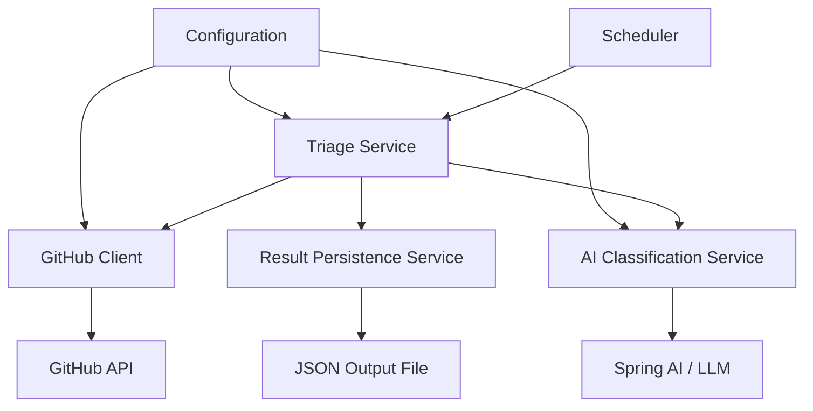

# Design Document: GitHub Issue Triage Agent

## Overview

The GitHub Issue Triage Agent is a Spring Boot application that leverages Spring AI to automatically classify and suggest responses for GitHub issues labeled with "pending-triage". The application uses a Large Language Model (LLM) to analyze issue content, categorize issues into Bug, Feature Request, Usability, or Question, and generate contextual response suggestions.

The system follows a batch processing model where it periodically fetches pending issues, processes them through the AI pipeline, and outputs structured triage results.

## Architecture

### High-Level Architecture



### Component Layers

1. **Scheduling Layer**: Manages periodic execution using Spring's `@Scheduled` annotation
2. **Service Layer**: Core business logic for orchestrating the triage workflow
3. **Integration Layer**: GitHub API client and Spring AI integration
4. **Persistence Layer**: Result storage and output formatting
5. **Configuration Layer**: Externalized configuration management

## Components and Interfaces

### 1. TriageScheduler

**Responsibility**: Trigger triage execution on a configured schedule

**Key Methods**:
- `executeTriage()`: Entry point for scheduled execution

**Dependencies**:
- `TriageService`
- `TriageConfiguration`

**Configuration**:
- Cron expression from properties
- Concurrent execution prevention using `@Scheduled` fixedDelay

### 2. TriageService

**Responsibility**: Orchestrate the complete triage workflow

**Key Methods**:
- `processAllPendingIssues()`: Main workflow coordinator
- `processIssue(GitHubIssue issue)`: Process a single issue
- `shouldProcessIssue(GitHubIssue issue)`: Validation logic

**Dependencies**:
- `GitHubClient`
- `AIClassificationService`
- `ResultPersistenceService`

**Workflow**:
1. Fetch issues with "pending-triage" label
2. For each issue, invoke AI classification
3. Collect results and persist
4. Log summary statistics

### 3. GitHubClient

**Responsibility**: Interface with GitHub REST API

**Key Methods**:
- `fetchPendingTriageIssues(String owner, String repo)`: Retrieve issues
- `authenticateRequest()`: Add authentication headers

**Configuration**:
- GitHub personal access token
- Repository owner and name
- API base URL

**Error Handling**:
- Rate limit detection and reporting
- Authentication failure handling
- Network timeout with retries

**Implementation Notes**:
- Use Spring's `RestTemplate` or `WebClient` for HTTP calls
- Parse GitHub API JSON responses into domain objects
- Handle pagination if issue count exceeds API limits

### 4. AIClassificationService

**Responsibility**: Use Spring AI to classify issues and generate responses

**Key Methods**:
- `classifyIssue(GitHubIssue issue)`: Returns `TriageResult`
- `buildClassificationPrompt(GitHubIssue issue)`: Construct LLM prompt
- `buildResponseSuggestionPrompt(GitHubIssue issue, IssueCategory category)`: Generate response

**Dependencies**:
- Spring AI `ChatClient` or `ChatModel`
- `PromptTemplate`

**Prompt Engineering**:

Classification Prompt Structure:
```
Analyze the following GitHub issue and classify it into exactly one category:
- Bug: Technical problems, errors, or unexpected behavior
- Feature Request: New functionality or enhancement requests  
- Usability: User experience issues or interface improvements
- Question: Requests for information or clarification

Issue Title: {title}
Issue Body: {body}
Issue Author: {author}

Respond in JSON format:
{
  "category": "<category>",
  "confidence": <0-100>,
  "reasoning": "<explanation>"
}
```

Response Suggestion Prompt Structure:
```
Generate a professional response for this GitHub issue classified as {category}.

Issue Title: {title}
Issue Body: {body}

Guidelines:
- For Bugs: Ask for reproduction steps, environment details, error logs
- For Feature Requests: Acknowledge the request, ask about use cases
- For Usability: Show empathy, discuss potential improvements
- For Questions: Provide direct answers or point to documentation

Generate a response suggestion (2-4 sentences):
```

**Configuration**:
- LLM provider (OpenAI, Azure OpenAI, Ollama, etc.)
- Model name (e.g., gpt-4, gpt-3.5-turbo)
- Temperature and other model parameters
- Retry configuration for LLM failures

### 5. ResultPersistenceService

**Responsibility**: Store and format triage results

**Key Methods**:
- `saveResults(List<TriageResult> results)`: Write to output file
- `formatAsJson(List<TriageResult> results)`: Convert to JSON
- `generateSummary(List<TriageResult> results)`: Create statistics

**Configuration**:
- Output file path
- Fallback directory for write failures

**Output Format**:
```json
{
  "triageRun": {
    "timestamp": "2025-11-04T10:30:00Z",
    "totalIssues": 5,
    "summary": {
      "Bug": 2,
      "Feature Request": 1,
      "Usability": 1,
      "Question": 1
    }
  },
  "results": [
    {
      "issueNumber": 123,
      "issueTitle": "Application crashes on startup",
      "issueUrl": "https://github.com/owner/repo/issues/123",
      "category": "Bug",
      "confidence": 95,
      "reasoning": "Issue describes unexpected application behavior with error messages",
      "responseSuggestion": "Thank you for reporting this. Could you provide the full error stack trace and your environment details (OS, Java version)?",
      "processedAt": "2025-11-04T10:30:15Z",
      "flaggedForManualReview": false
    }
  ]
}
```

## Data Models

### GitHubIssue

```java
public class GitHubIssue {
    private Long number;
    private String title;
    private String body;
    private String author;
    private LocalDateTime createdAt;
    private String url;
    private List<String> labels;
}
```

### IssueCategory (Enum)

```java
public enum IssueCategory {
    BUG,
    FEATURE_REQUEST,
    USABILITY,
    QUESTION
}
```

### TriageResult

```java
public class TriageResult {
    private Long issueNumber;
    private String issueTitle;
    private String issueUrl;
    private IssueCategory category;
    private Integer confidence;
    private String reasoning;
    private String responseSuggestion;
    private LocalDateTime processedAt;
    private boolean flaggedForManualReview;
}
```

### TriageConfiguration

```java
@ConfigurationProperties(prefix = "triage")
public class TriageConfiguration {
    private GitHub github;
    private AI ai;
    private String outputPath;
    private String schedule;
    
    public static class GitHub {
        private String owner;
        private String repo;
        private String token;
    }
    
    public static class AI {
        private String provider;
        private String model;
        private Double temperature;
        private Integer maxRetries;
    }
}
```

## Configuration

### application.yml

```yaml
triage:
  github:
    owner: ${GITHUB_OWNER}
    repo: ${GITHUB_REPO}
    token: ${GITHUB_TOKEN}
  ai:
    provider: openai
    model: gpt-4
    temperature: 0.3
    max-retries: 3
  output-path: ./triage-results.json
  schedule: "0 0 */6 * * *"  # Every 6 hours

spring:
  ai:
    openai:
      api-key: ${OPENAI_API_KEY}
      chat:
        options:
          model: ${triage.ai.model}
          temperature: ${triage.ai.temperature}

logging:
  level:
    com.example.triage: INFO
    org.springframework.ai: DEBUG
```

## Error Handling

### Error Categories and Strategies

1. **GitHub API Errors**
   - Rate Limit Exceeded: Log reset time, exit with code 2
   - Authentication Failed: Log error, exit with code 3
   - Network Timeout: Retry up to 3 times with exponential backoff (1s, 2s, 4s)

2. **LLM Service Errors**
   - Service Unavailable: Retry up to 3 times with exponential backoff (2s, 4s, 8s)
   - Invalid Response Format: Log warning, flag issue for manual review, continue
   - Token Limit Exceeded: Truncate issue body, retry once

3. **Persistence Errors**
   - File Write Failed: Attempt fallback to `./triage-results-{timestamp}.json`
   - Disk Full: Log critical error, exit with code 4

4. **Individual Issue Processing Errors**
   - Strategy: Log error with issue number, continue processing remaining issues
   - Track failed issues in summary output

### Retry Configuration

```java
@Retryable(
    value = {RestClientException.class},
    maxAttempts = 3,
    backoff = @Backoff(delay = 1000, multiplier = 2)
)
```

## Testing Strategy

### Unit Tests

1. **TriageService Tests**
   - Test workflow orchestration with mocked dependencies
   - Verify error handling for individual issue failures
   - Validate summary statistics calculation

2. **AIClassificationService Tests**
   - Test prompt construction with various issue formats
   - Verify JSON parsing of LLM responses
   - Test confidence threshold logic for manual review flagging

3. **GitHubClient Tests**
   - Mock GitHub API responses
   - Test authentication header injection
   - Verify error handling for rate limits and auth failures

4. **ResultPersistenceService Tests**
   - Test JSON formatting
   - Verify file write operations
   - Test fallback behavior for write failures

### Integration Tests

1. **End-to-End Triage Flow**
   - Use WireMock for GitHub API
   - Use test LLM responses or local model
   - Verify complete workflow from fetch to persistence

2. **Spring AI Integration**
   - Test with actual LLM (in CI with API key)
   - Verify prompt templates produce expected classifications
   - Test retry behavior with simulated failures

3. **Configuration Tests**
   - Verify property binding
   - Test with missing required properties
   - Validate environment variable substitution

### Manual Testing Checklist

- Run against real GitHub repository with test issues
- Verify classifications match expected categories
- Review response suggestions for quality and appropriateness
- Test scheduled execution over multiple cycles
- Validate output file format and readability

## Security Considerations

1. **Secrets Management**
   - Never commit GitHub tokens or API keys
   - Use environment variables or secret management service
   - Mask tokens in logs

2. **API Token Permissions**
   - GitHub token requires only `repo:read` scope for public repos
   - For private repos, requires `repo` scope
   - Document minimum required permissions

3. **Input Validation**
   - Sanitize issue content before sending to LLM
   - Limit issue body length to prevent token exhaustion
   - Validate JSON responses from LLM before parsing

## Performance Considerations

1. **Batch Processing**
   - Process issues in parallel using `CompletableFuture` (max 5 concurrent)
   - Implement circuit breaker for LLM service

2. **Rate Limiting**
   - Respect GitHub API rate limits (5000 requests/hour for authenticated)
   - Implement request throttling if needed

3. **Resource Usage**
   - Limit issue body size sent to LLM (max 4000 characters)
   - Stream large result sets to file instead of holding in memory

## Deployment

### Prerequisites
- Java 17 or higher
- Maven or Gradle
- GitHub personal access token
- LLM API key (OpenAI, Azure, etc.)

### Build and Run

```bash
# Build
./mvnw clean package

# Run with environment variables
export GITHUB_OWNER=myorg
export GITHUB_REPO=myrepo
export GITHUB_TOKEN=ghp_xxxxx
export OPENAI_API_KEY=sk-xxxxx

java -jar target/gh-issue-triage-agent-1.0.0.jar
```

### Docker Deployment

```dockerfile
FROM eclipse-temurin:17-jre
COPY target/gh-issue-triage-agent-1.0.0.jar app.jar
ENTRYPOINT ["java", "-jar", "/app.jar"]
```

### Scheduling Options

1. **Internal Scheduler**: Use Spring's `@Scheduled` (default)
2. **External Cron**: Run as one-shot command from cron
3. **Kubernetes CronJob**: Deploy as scheduled job in K8s
4. **GitHub Actions**: Trigger via workflow schedule
