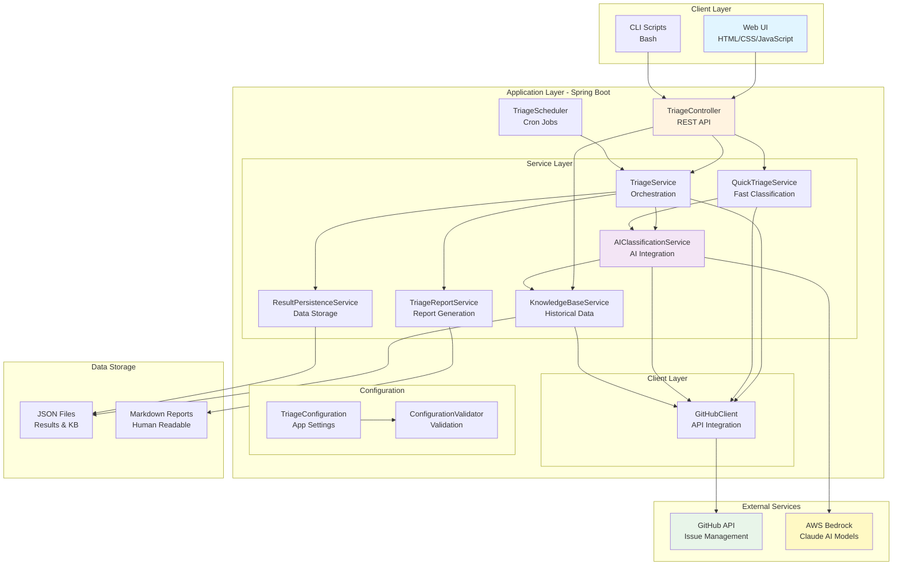
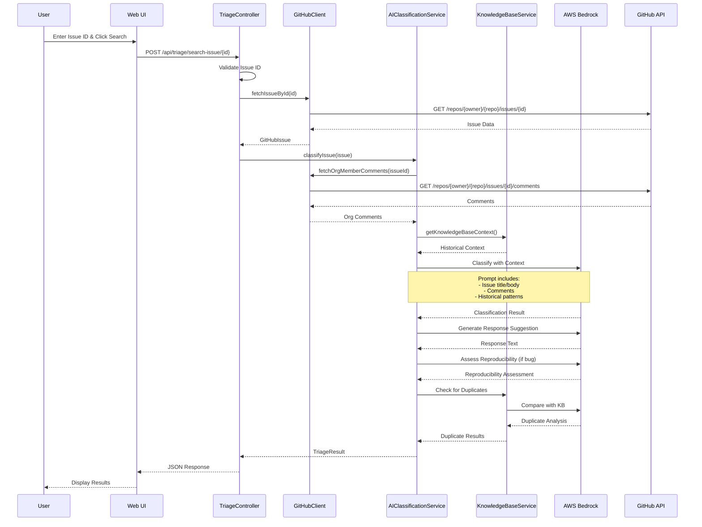
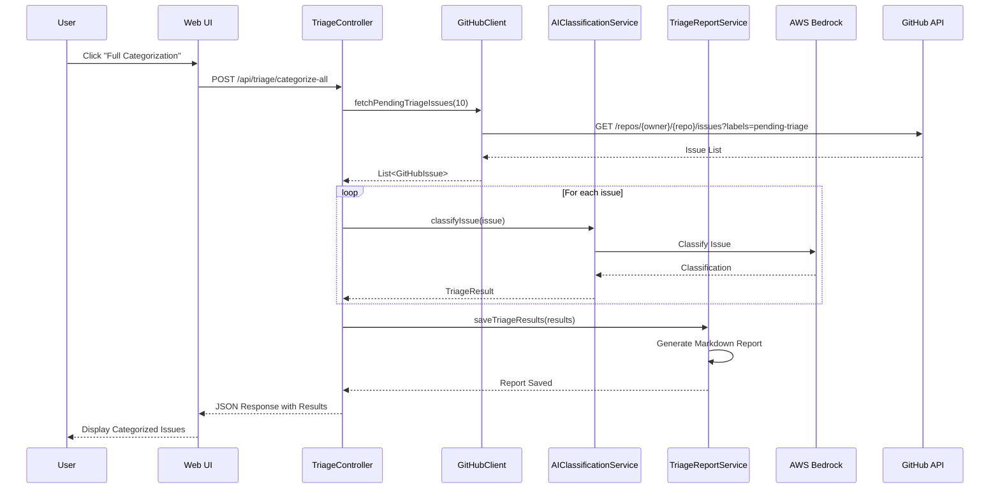
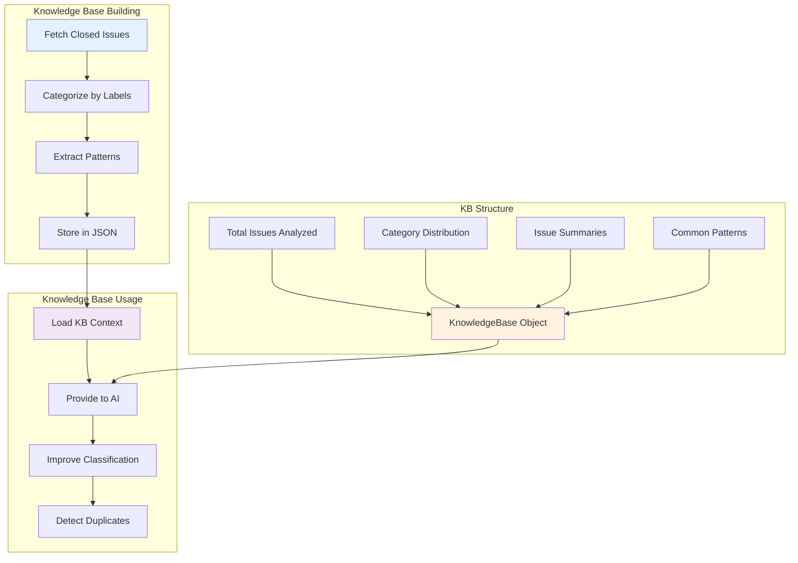
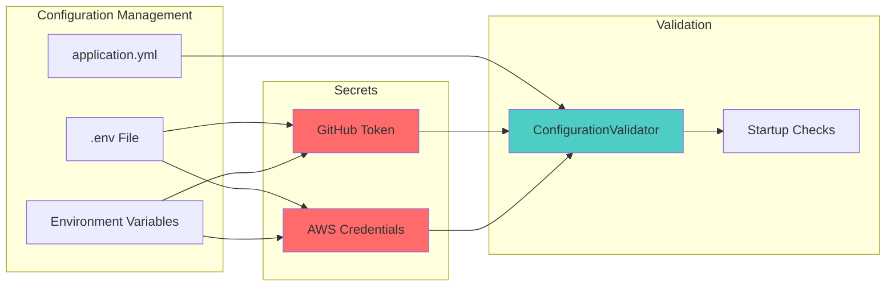
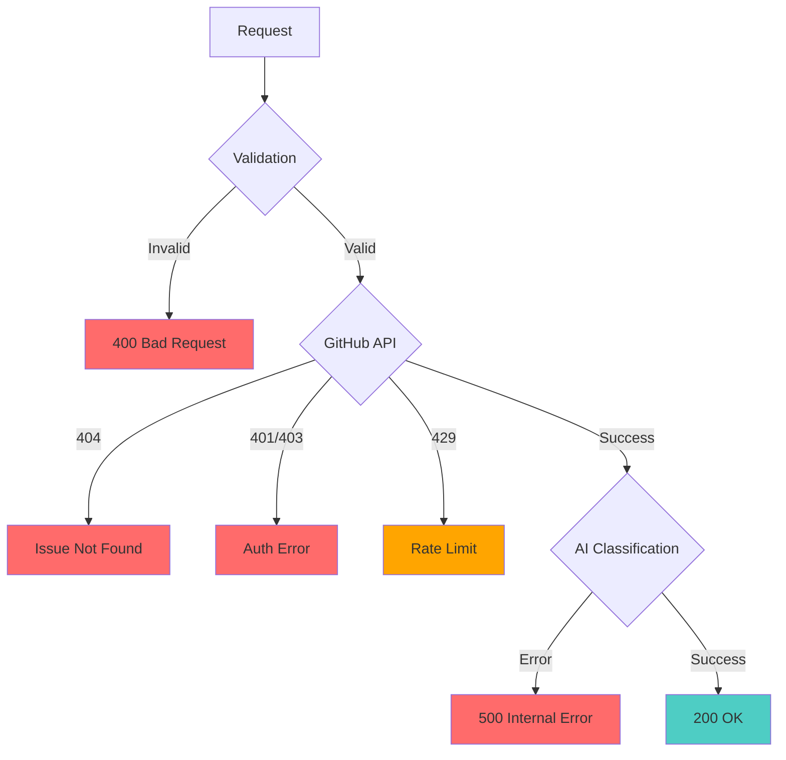

# GitHub Issue Triage Agent - Architecture

## System Overview

The GitHub Issue Triage Agent is an AI-powered Spring Boot application that automatically categorizes and analyzes GitHub issues using AWS Bedrock's Claude models.

## High-Level Architecture



## Component Architecture

```mermaid
graph LR
    subgraph "Presentation Layer"
        A[index.html<br/>Main Dashboard]
        B[categorize.html<br/>Bulk Operations]
        C[app.js<br/>Main Logic]
        D[categorize.js<br/>Bulk Logic]
    end
    
    subgraph "API Layer"
        E[REST Endpoints]
        E1[/api/triage/search-issue]
        E2[/api/triage/categorize-all]
        E3[/api/triage/issues]
        E4[/api/triage/quick-triage]
        E5[/api/triage/update-labels]
        
        E --> E1
        E --> E2
        E --> E3
        E --> E4
        E --> E5
    end
    
    subgraph "Business Logic"
        F[Services]
        F1[Classification]
        F2[Knowledge Base]
        F3[Reporting]
        F4[Persistence]
        
        F --> F1
        F --> F2
        F --> F3
        F --> F4
    end
    
    subgraph "Integration Layer"
        G[External APIs]
        G1[GitHub REST API]
        G2[AWS Bedrock API]
        
        G --> G1
        G --> G2
    end
    
    A --> C
    B --> D
    C --> E
    D --> E
    E --> F
    F --> G
    
    style A fill:#e3f2fd
    style B fill:#e3f2fd
    style E fill:#fff3e0
    style F fill:#f3e5f5
    style G fill:#e8f5e9
```

## Data Flow - Issue Search & Triage



## Data Flow - Bulk Categorization



## Knowledge Base System



## Technology Stack

```mermaid
graph LR
    subgraph "Frontend"
        A[HTML5]
        B[CSS3]
        C[JavaScript ES6+]
    end
    
    subgraph "Backend"
        D[Spring Boot 3.2.0]
        E[Java 17+]
        F[Spring Web]
        G[Spring AI]
    end
    
    subgraph "AI/ML"
        H[AWS Bedrock]
        I[Claude 3.5 Haiku]
        J[Claude 3.5 Sonnet]
        K[Claude 4.5 Sonnet]
    end
    
    subgraph "Integration"
        L[GitHub REST API]
        M[Apache HttpClient 5]
    end
    
    subgraph "Build & Deploy"
        N[Maven]
        O[Spring Boot Maven Plugin]
    end
    
    A --> D
    B --> D
    C --> D
    D --> H
    D --> L
    E --> D
    F --> D
    G --> H
    H --> I
    H --> J
    H --> K
    N --> O
    
    style D fill:#6db33f
    style H fill:#ff9900
    style L fill:#181717
```



## Deployment Architecture

```mermaid
graph TB
    subgraph "Local Development"
        A[Developer Machine]
        B[./run-local.sh]
        C[Spring Boot App<br/>Port 8080]
    end
    
    subgraph "Configuration"
        D[.env File]
        E[application.yml]
        F[Environment Variables]
    end
    
    subgraph "External Dependencies"
        G[GitHub API<br/>api.github.com]
        H[AWS Bedrock<br/>us-east-1]
    end
    
    subgraph "Data Files"
        I[knowledge-base.json]
        J[triage-results.json]
        K[triage-report.md]
    end
    
    A --> B
    B --> C
    D --> C
    E --> C
    F --> C
    C --> G
    C --> H
    C --> I
    C --> J
    C --> K
    
    style C fill:#6db33f
    style G fill:#181717
    style H fill:#ff9900
```



## Security & Configuration



## Key Features

### 1. Search by Issue ID
- Direct issue lookup and classification
- Real-time AI analysis
- Comprehensive triage results

### 2. Bulk Categorization
- Process multiple issues at once
- Batch classification
- Automated label updates

### 3. Knowledge Base
- Learn from historical issues
- Improve classification accuracy
- Detect duplicate issues

### 4. Quick Triage
- Fast title-based classification
- Lightweight analysis
- Rapid initial assessment

### 5. Reporting
- Markdown report generation
- JSON data export
- Human-readable summaries

## API Endpoints

| Endpoint | Method | Description |
|----------|--------|-------------|
| `/api/triage/search-issue/{id}` | POST | Search and triage single issue |
| `/api/triage/issues` | GET | Fetch pending triage issues |
| `/api/triage/categorize-all` | POST | Bulk categorize issues |
| `/api/triage/quick-triage` | POST | Quick title-based triage |
| `/api/triage/update-labels/{id}` | POST | Update issue labels |
| `/api/triage/knowledge-base/build` | POST | Build knowledge base |
| `/api/triage/knowledge-base/status` | GET | Get KB status |
| `/api/triage/statistics` | GET | Get triage statistics |

## Error Handling



## Performance Considerations

- **Retry Logic**: Automatic retry for transient failures
- **Rate Limiting**: Respects GitHub API rate limits
- **Caching**: Knowledge base cached in memory
- **Pagination**: Efficient handling of large issue lists
- **Async Processing**: Non-blocking AI classification
- **Connection Pooling**: Reusable HTTP connections

## Future Enhancements

1. **Database Integration**: Replace JSON with PostgreSQL/MongoDB
2. **Authentication**: Add user authentication and authorization
3. **Webhooks**: Real-time issue processing via GitHub webhooks
4. **Analytics Dashboard**: Advanced metrics and visualizations
5. **Multi-Repository Support**: Triage issues across multiple repos
6. **Custom Models**: Support for fine-tuned AI models
7. **API Rate Limiting**: Implement application-level rate limiting
8. **Containerization**: Docker support for easy deployment
